# NEUQACMClub技术部第二次课程

## 前言
本次技术培训我们主要为大家介绍程序员最最最常用的社(gao)交(ji)网站github，同时引导大家学会使用github，学会了这个对我们是有很多好处的，从现阶段来看，我们可以利用一种很"程序猿"的方式来对我们每周的周报进行收取，掌握github的使用之后，以后再学习git是可以对我们以后的工程开发起一个比较引导性的作用的，这次课程我个人觉得是有点难度，但我会尽量给大家讲解清楚的！

---

## 关于github
github是目前全球最大的程序开源社区平台，所有程序员最大的社交平台，于2018年5月份被微软公司所收购，里面有许许多多著名的开源项目例如：[React](https://github.com/facebook/react)(目前全球最火的前端框架)，python,Ruby,Jquery等,我们可以通过github对我们自己的代码进行管理(通过创建仓库的形式)，当然不只是代码，我们也可以传一些其他形式的文件上去，比如阮一峰老师的[《ES6 入门》](https://github.com/ruanyf/es6tutorial)这本经典的前端书籍便是在github上面开源。同样，我们本次的周报可以作为开源项目托管在github上面，而维护这个项目的便是目前NEUQACM俱乐部的你们啦。(可以当成一个你们参与的第一个开源项目).

---

## 说明
- 下面的内容建议大家多通过实战来实现.
- 可能教程中的一些个图片有些不清楚，我后续将原图放在通知群里面，大家可以对照着看.
- 内容写的不是很详细，后续github的教程我会发布在我个人的博客上面，本篇重点还是在学习github上
- **我们本次周报的仓库名称叫做"NEUQACMClub-weekly"**

---

## 注册github账号
**官方网址:http://github.com/**

注册点击 **Sign up**(登录点击 **Sign in**).

**Step1.填写用户名,邮箱,和密码来注册github账号.**

**Step2.这个页面的作用是选择你的计划.这里我们默认继续下一步就行啦~**

**Step3.是一个用户调查界面,可以直接跳过这一步(Skip this step)**

完成这三步之后我们,我们的github的账户便注册完成啦.

---

## github的一些基本概念
大家先别急着操作github，我先给大家普及一些github的知识吧。

先给大家献上我们目前的主页图:
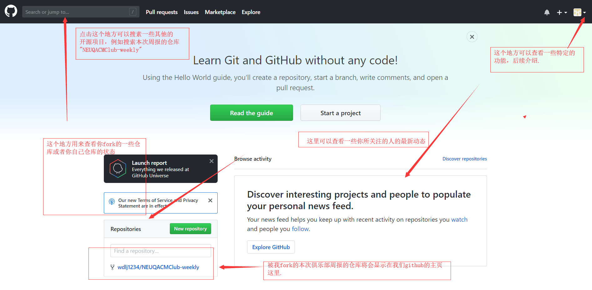

1. 首先我们注册完成之后进入github的第一个界面便是github主页图.
左侧显示你的仓库(fork和你自己的),中间显示用户动态或关注仓库的动态.(登录状态)

2. 然后我们点击主页右上角的个人头像，会有几个下拉选项，我们点击"Your Profile"进入我们的个人主页。
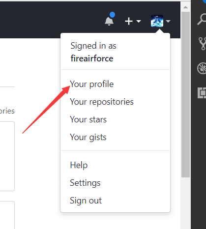

个人主页的效果是这样的:
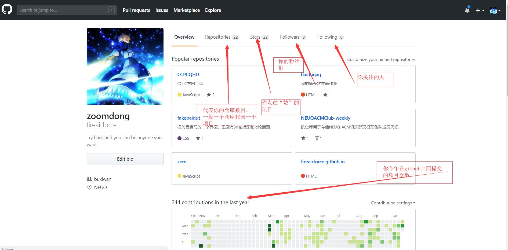
个人主页所包含的信息大致就是一些个人的信息,头像,个人简介,地址等等.

## 仓库(Repository)
仓库的就是指的你的项目,如果想在github上面开源一个项目,就必须要创建一个repository，一般情况下一个项目就代表一个仓库，比如我们可以在github顶部导航栏搜索我们周报的仓库名"NEUQACMClub-weekly"便可以找到我们对应的项目.

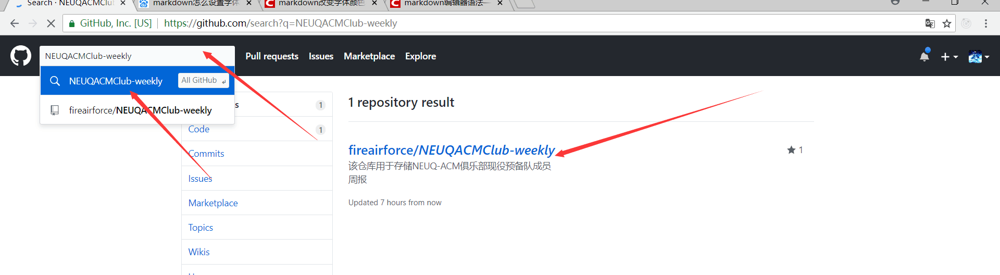

## 仓库操作
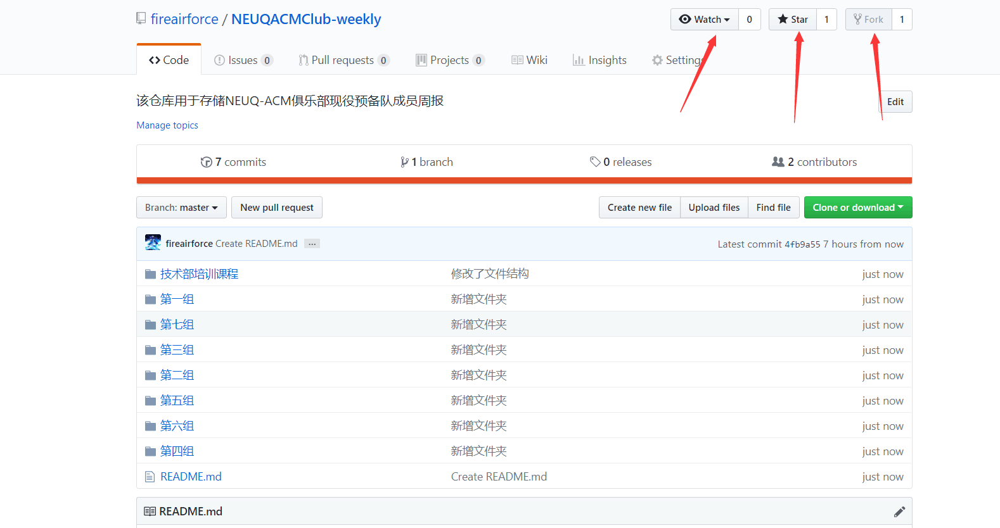

我们点击进去周报仓库之后是如此这样的一番样子。

我先挨个来介绍如何使用这个仓库:

首先最右上角的部分三个按钮分别为:**关注(Watch)**,**收藏(Star)**,**复制项目(Fork)**.

如果你watch了某个项目,那么以后只要这个项目有任何更新,你都会在第一时间之内收到关于这个项目的通知提醒.你觉得一个开源项目不错,就可以watch一波.建议大家对周报文件进行一波watch，因为日后我们也可以看看其他同学的周报通过来对进行相互学习(因为他一旦更新周报你的github主页这边这边就可以收到提醒)。

star按钮的意思为收藏项目的人数,如果你对一个项目进行了star，那么在你的个人主页的栏里点击Stars按钮便可以看见你star的项目，所以我也建议大家对这个周报项目进行star，便于大家以后好找到。

**当然我们这里的重点是Fork，这里我要求俱乐部目前大一现役预备队所有成员都要对我们这个项目进行Fork，Fork的意思就是指你克隆复制了这个项目，然后这个项目就会被复制到你本地的仓库里面去，你以后就可以直接对这个仓库里面的内容进行修改，然后通过pull requests操作来将你修改过后的项目提交到我这边来**

然后往下面看，我们目前处于仓库的Code标签页里面，这也是默认的标签页.这个标签页下面我也不会给我只给大家介绍其中的一个：Pull Requests.

还记得前面给大家讲了Fork吗？当你把一个仓库(例如我们的周报仓库),点击fork按钮将仓库fork到你自己的本地之后，然后这个仓库相当于在你本地生成了一个镜像文件，然后你就可以通过在你本地对仓库的文件进行修改(例如创建周报文件)，修改完成之后然后通过pull requests的方式来将你修改的文件发送到我们周报的原仓库来，由原仓库的管理员来审核文件是否正确然后将你的周报文件合并到仓库上面.

---

## 提交周报
鉴于上面介绍的知识初次接触可能会比较懵逼，我这里还是手把手来教大家怎么提交个人的周报.

1.首先在github主页左上角顶部导航栏的搜索框里面搜索"NEUQACMClub-weekly"搜索我们周报所在的仓库，后面带有All Github的那一个搜索栏目.
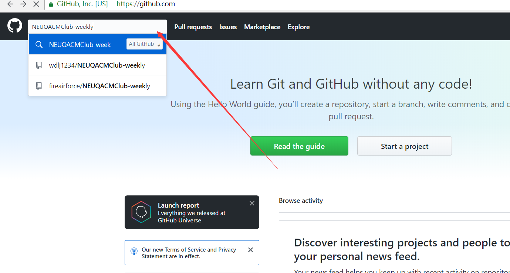

搜索结果如下:
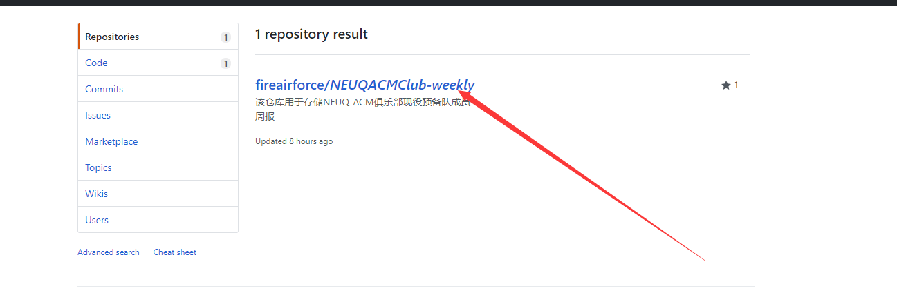

点击进入:
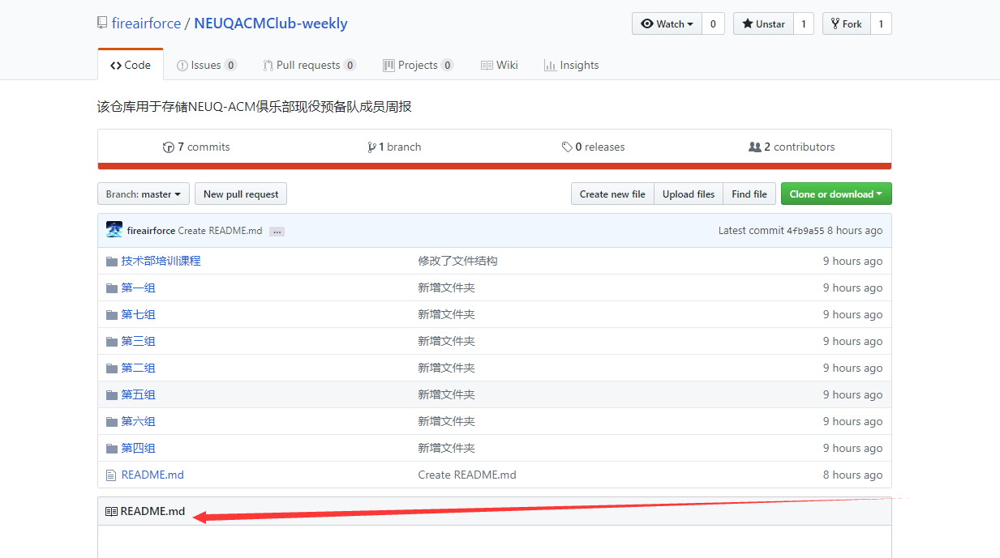

中间最引人注目的那一堆文件结构就是我们自己的文件结构，里面分别存有每一组(上周有分过组)2018年所有的周报文件，同时下面用箭头标明的"README.md"文件是我写的一个说明文件，这个当然也是用markdown写的(github是支持markdown语法的渲染的)，上面的说明可以建议同学们看一下。

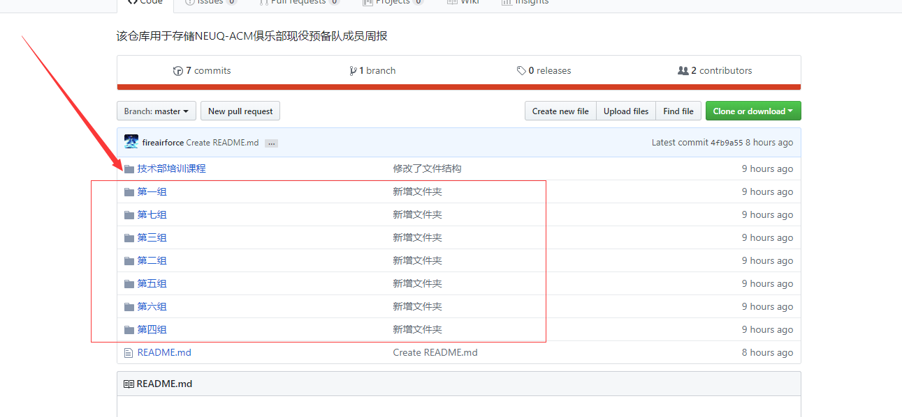
箭头所指定的文件夹是每周培训的文件，当然这个在ACM通知群里也以PDF的形式发布，然后被框住的文件夹则是每个小组的周报内容.

2.然后我们需要对仓库进行fork(克隆到本地).
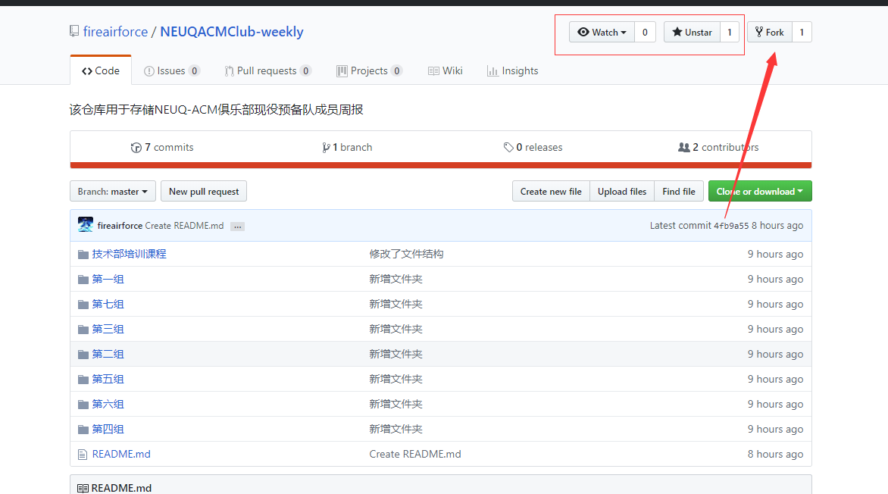
同时我希望同学们也能对这个仓库进行star和watch，因为由于技术原因，你fork过去的仓库就只能保存看见当前的文件内容，我们最后所有的周报文件都是合并到现在这个你fork的仓库里的，你如果star或者watch之后，以后这个仓库有更新的话，你的github主页便可以第一时间收到通知.

仓库fork过来之后：
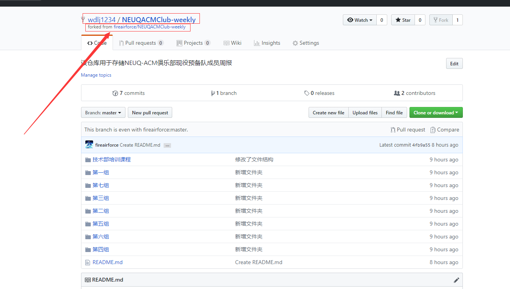

我们自己的github主页就会多出一个仓库，然后我们可以通过这个github仓库来对我们自己的周报文件进行编辑。

3.我们以第一组的同学为例，假如我是第一组的唐文浩同学。我要进行本周周报的提交，那我点击第一组的文件夹。
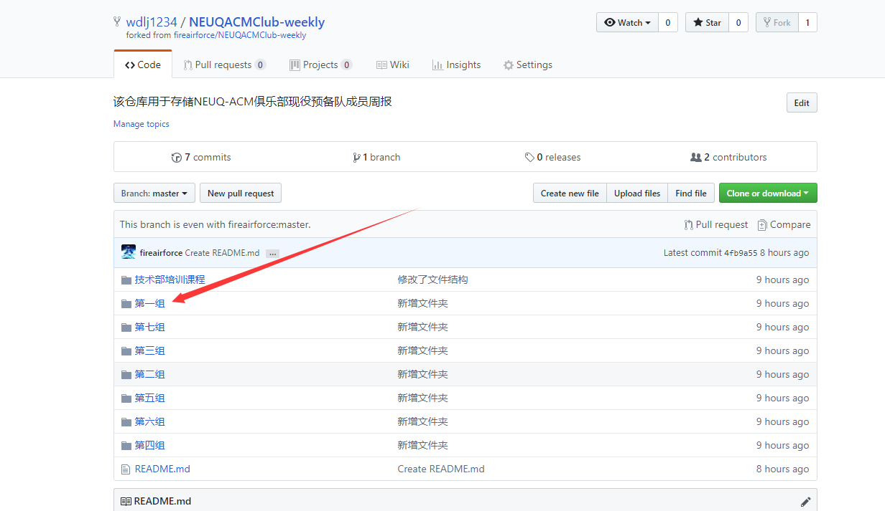

点进去之后的是一堆时间的文件夹，我们这周的周末是10月28号，然后我们便在10月28号文件夹里面添加自己的周报文件。
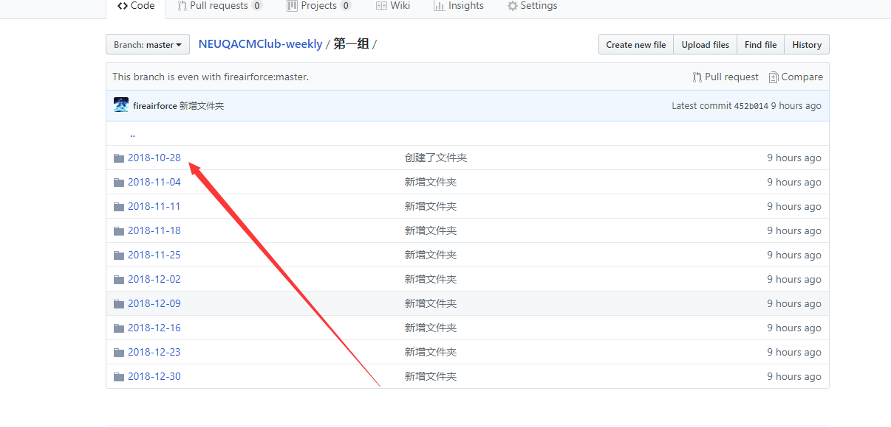

第一次进去的时候里面只有一个.gitkeep文件，**这个文件我们不要动**,我们添加自己的周报文件直接点击**图示箭头**所致的右上角点击Create new file这个按钮。
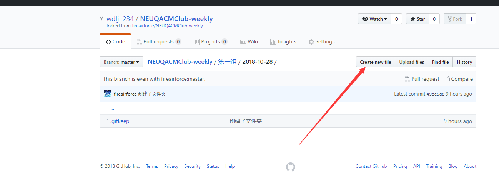

出现这样的界面，我们便可以直接对这个界面进行编辑了:
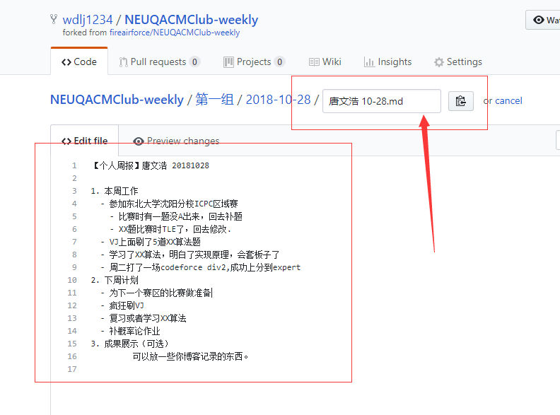
箭头指向为周报文件名 每个人的文件名格式应该是姓名+日期，例如"唐文浩 10-28.md",必须是以.md为后缀的文件格式命名，同时要遵循命名规范，然后我们便可以直接将自己本地写好的markdown语法复制粘贴到上面来.

然后将界面往下面翻:
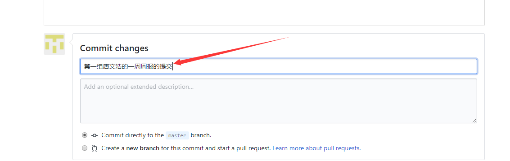
下面会有两个输入框，

4.编辑完成周报文件之后，然后点击那个绿色的提交按钮，然后便会出现这样的界面:
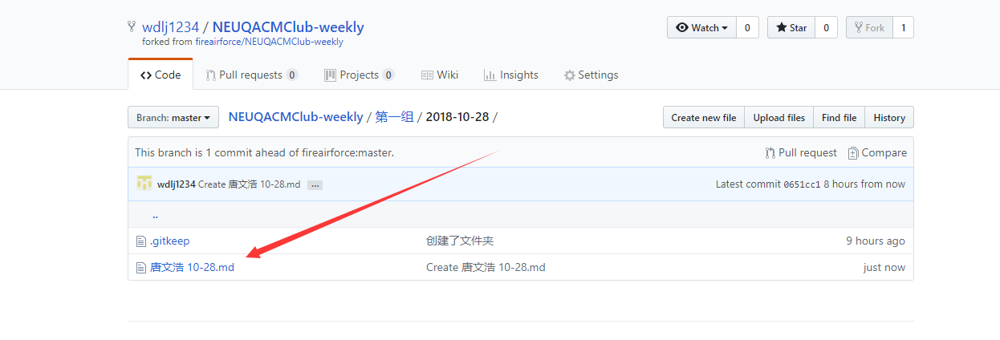

于是我们可以点击进去看一下我们的周报成果:
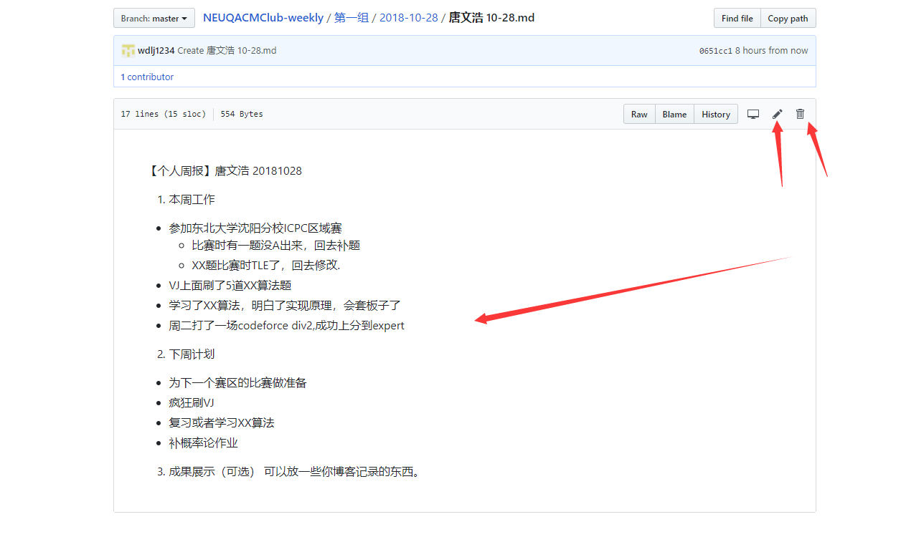
如果觉得周报没有达到预期的目标或者**有些地方需要修改**直接点击**红色箭头**所标示的第一个箭头的地方,然后又可以回到我们markdown的编写界面，直接对我们有问题的地方进行修改即可，第二个红色箭头是直接对该文件进行删除，一般我们不怎么用这个功能。

5.于是我们把周报弄完之后(文章和格式都啥问题之后)，我们便可以将周报上传到我们的周报主仓库里面来了.
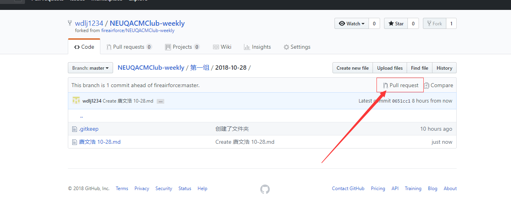 

我们点击这个灰色pull requests按钮，然后点击绿色的Create pull request按钮.
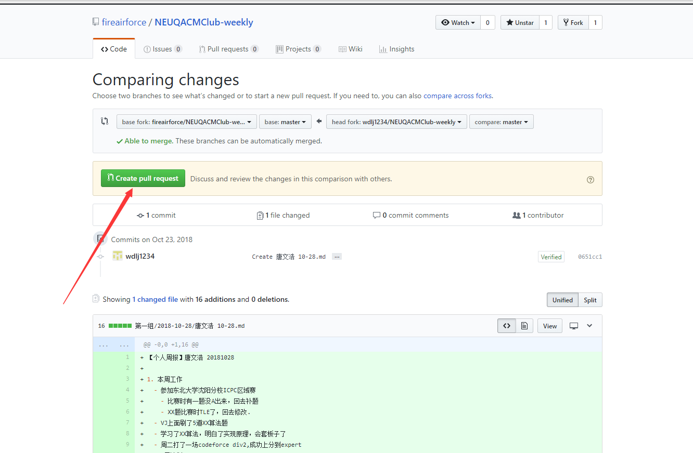

然后进入这个界面:
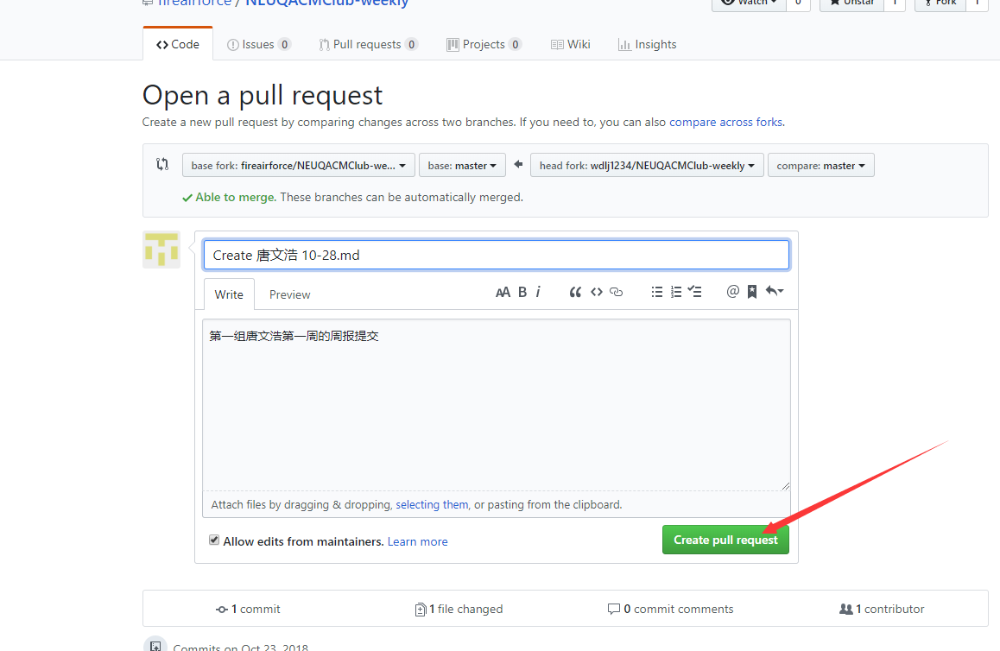,点击提交按钮，然后就可以了。

出现这样的界面之后然后就我们就提交成功了，这个时候等待学长的审核即可。
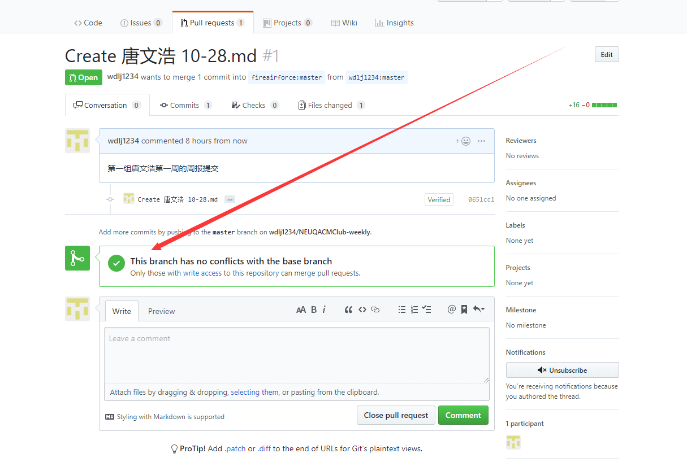

审核通过之后，然后学长这边合并了你的然后你的周报就会出现在主的仓库里面啦！

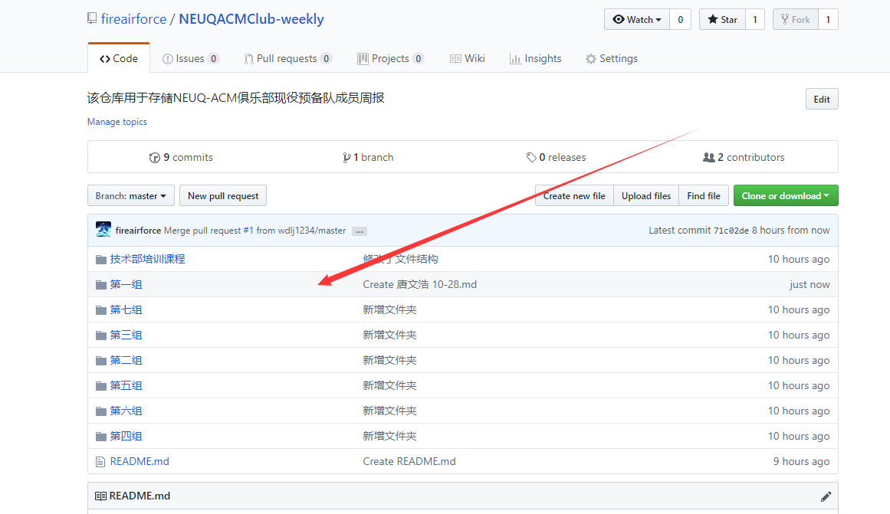
比如刚才的那个周报提交之后，某wd学长收到了，然后直接合并过来，这样周报便出现了！

---

## 作业
- 注册申请github账号，并请各组小组长将成员的github用户名统计用excel整理出来。
- 完成一篇周报并进行提交。
   - 先Fork学长本地的github仓库同时对仓库进行star和watch
   - 然后在指定目录下创建自己的周报文件(注意是.md格式的文件)
   - 编辑完成自己的周报之后进行进行本地的保存
   - 发送pull requests到周报的本地仓库
- Follow技术部学长学姐的github账号(例如fireairforce,ailpf)
   - 这个教程里面没有写，算是交给大家的一个自学任务. 

## 注意事项
- 目前大一一学年的周报文件已经全部建立完成
- 如果你fork仓库之后在本地不小心删除了一个原仓库上的文件或者其他人的周报，建议直接删除你fork过来的这个仓库，然后再重新fork一次(这里不用体验从删库到跑路)(后期教你们如何回退版本)
- 一般情况下，你把原本的仓库fork过去按照流程走，只写自己的周报并且提交是可以使用一整年的.
- 如果想看其他同学的周报，或者看整个仓库的源文件，可以在仓库的主页里面有个Clone or Download的绿色按钮，点击这个就可以将所有的内容全部下载下到本地来.
- 还有其他问题请在ACM生活群里面问学长.

---
